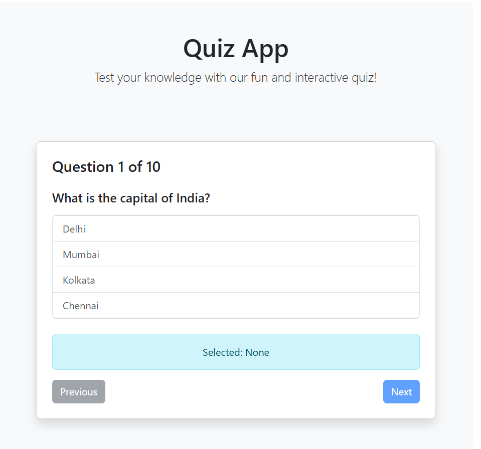

# 🎯 Quiz Web App

An interactive and responsive Quiz Application built using **React + Vite**.
Users can answer multiple-choice questions and instantly see their results.

---

## 🚀 Live Demo

🔗 Coming Soon (Deploy using Vercel / Netlify)

---

## 📸 Screenshots

### 🏠 Home Page

<p align="center">
  
</p>

### 📊 Result Page

<p align="center">
  
</p>

---

## ✨ Features

* 🧠 Multiple-choice quiz questions
* ⚡ Fast performance using Vite
* 📊 Instant result calculation
* 🎨 Clean and responsive UI
* 🔁 Restart quiz option

---

## 🛠️ Tech Stack

* ⚛️ React
* ⚡ Vite
* 🎨 CSS / Bootstrap

---

## 📁 Project Structure

```plaintext
Quiz-web-App/
│── public/
│   └── screenshots/
│       ├── start.png
│       └── end.png
│── src/
│   ├── assets/
│   │   └── components/
│   │       ├── Quiz.jsx
│   │       └── Result.jsx
│   ├── App.jsx
│   └── main.jsx
│── package.json
│── README.md
```

---

## ⚙️ Installation & Setup

1. Clone the repository:

```bash
git clone https://github.com/kanakaraju1a/Quiz-web-App.git
```

2. Navigate to project folder:

```bash
cd Quiz-web-App
```

3. Install dependencies:

```bash
npm install
```

4. Run the app:

```bash
npm run dev
```

---

## 🙋‍♂️ Author

**Kanakaraju**

* GitHub: https://github.com/kanakaraju1a

---

## ⭐ Support

If you like this project, give it a ⭐ on GitHub!

---
